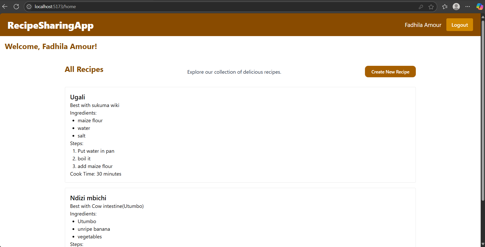
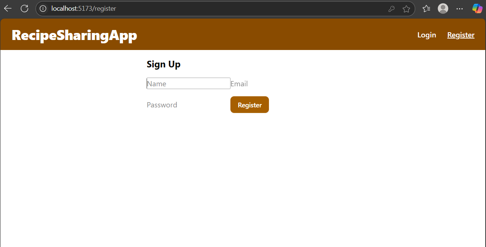
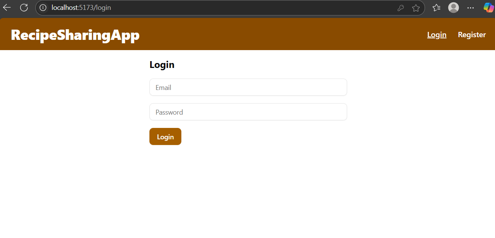
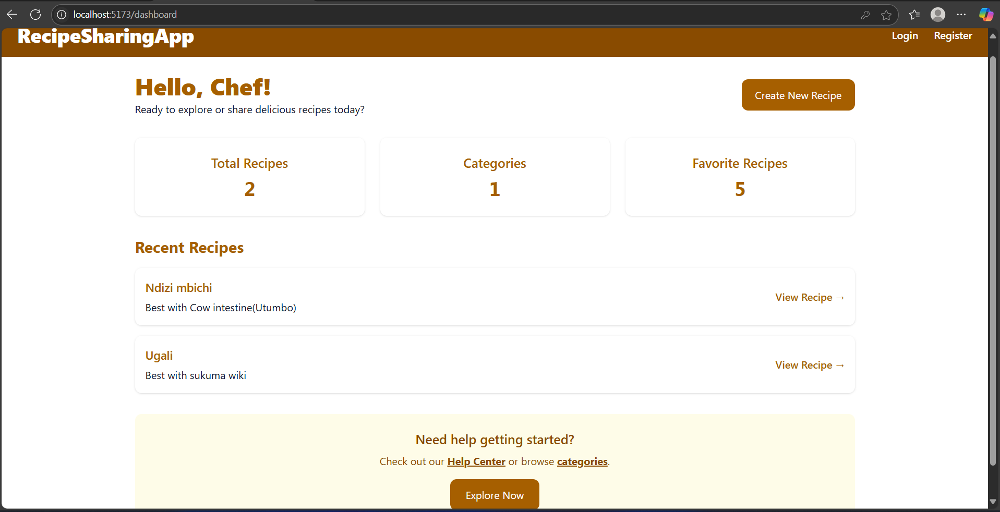

# 🍲 Recipe Sharing App

A full-stack MERN (MongoDB, Express, React, Node.js) application where users can create, share, and discover delicious recipes.

---

## 📖 Project Overview

The **Recipe Sharing App** is an interactive platform where:

* Users can register and log in securely.
* Users can post, edit, and delete recipes.
* Recipes are categorized and searchable.
* Other users can view and comment on recipes.
* Admins can manage categories.

---
Project Structure
recipe-sharing-app/
├── client/                     # React frontend
│   ├── public/
│   ├── src/
│   │   ├── components/         # Reusable components (Navbar, PostItem, etc.)
│   │   ├── context/            # AuthContext for user session management
│   │   ├── hooks/              # Custom React hooks
│   │   ├── pages/              # Pages like Home, Login, Register, Dashboard
│   │   ├── services/           # Axios instance + API functions
│   │   ├── utils/              # ProtectedRoute and helpers
│   │   └── App.jsx             # Main component with routes
│   └── package.json
│   └── vite.config.js
│
├── server/                     # Node.js backend
│   ├── config/                 # MongoDB config
    ├─  Controllers/            # Route logic (Post, Auth, Category, etc.)
│   ├── middleware/             # Auth, validateRequest, file upload
│   ├── models/                 # Mongoose schemas (User, Post, Category)
│   ├── routes/                 # Express routers
│   ├── uploads/                # Uploaded images
│   ├── server.js               # Main Express entry file 
│   ├─  package.json               
│   └── .env                    # Environment variables
├── screenshots                 # Screenshots of the application                        
├── .gitignore
└── README.md


## ⚙️ Setup Instructions

### 1. Clone the repository

```bash
git clone https://github.com/Lutty112/week-4-mern-integration-assignment-Lutty112.git
cd week-4-mern-integration-assignment-Lutty112
```

### 2. Server Setup

```bash
cd server
pnpm install
touch .env
```

Create a `.env` file with the following content:

```
MONGO_URI=your_mongodb_connection_string
JWT_SECRET=your_jwt_secret
```

Run the backend:

```bash
pnpm run dev
```

### 3. Client Setup

```bash
cd client
pnpm install
pnpm run dev
```
Then open: http://localhost:5173
---

## 🔗 API Documentation

### Auth Routes

* `POST /api/auth/register` — Register new user
* `POST /api/auth/login` — Log in and get JWT token

### Post Routes

* `GET /api/posts/` — Get all recipes
* `GET /api/posts/:slug` — Get a single recipe by slug
* `POST /api/posts/` — Create a recipe *(protected)*
* `PUT /api/posts/:id` — Update a recipe *(owner/admin only)*
* `DELETE /api/posts/:id` — Delete a recipe *(owner/admin only)*

### Category Routes

* `GET /api/category/` — List all categories
* `POST /api/category/` — Add a new category *(protected)*
* `DELETE /api/category/:id` — Delete a category *(protected)*

---

## ✅ Features Implemented

* Secure user registration and login (JWT-based)
* CRUD for recipes with slug-based access
* Recipe categories and tags
* Image upload for featured images
* Comment section per recipe
* Role-based authorization for admin functions
* React UI with Tailwind CSS
* Route protection with context
* Responsive layout for desktop and mobile
---


## 🖼️ Screenshots

### Homepage



### Register Page



### Login Page



### Dashboard View



---

## 🙋🏻 Contributing

Contributions are welcome! Please fork the repo and submit a pull request.

## 👩‍💻 Author
Lutfia Mosi — GitHub 
---

## ℹ️ License

This project is licensed under the MIT License. See the [LICENSE](LICENSE) file for details.


